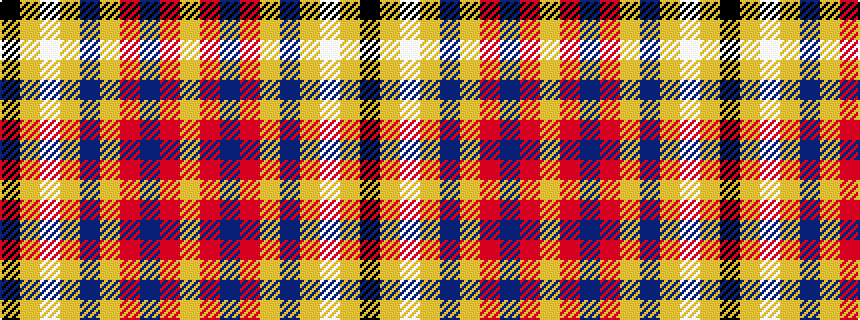

KYWYBYRBRY

It is a 10 stripe tartan.

<figure class="pat-woven">

<figcaption>idealised sample</figcaption>
</figure>

## Colour Sequence



## Tartans with this colour sequence

| Tartans |
|---------------|
| [MacLeroy & Troine](/variants/s10/k2lg3w2lg3n4lg19o6n23r3ly2~x2/)|
||
