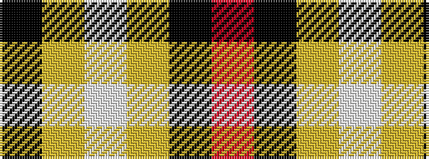

KYWYKR

It is a 6 stripe tartan.

<figure class="pat-woven">

<figcaption>idealised sample</figcaption>
</figure>

## Colour Sequence



## Tartans with this colour sequence

| Tartans |
|---------------|
| [Canyon County Idaho Sheriff](/setts/s6/k5lo5w1lo5k5r1~x10/)|
||
