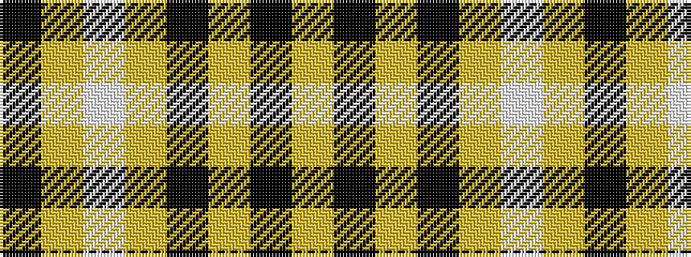

KYWYKYKY

It is a 8 stripe tartan.

<figure class="pat-woven">

<figcaption>idealised sample</figcaption>
</figure>

## Colour Sequence



## Tartans with this colour sequence

| Tartans |
|---------------|
| [Erck, Georges van (Personal),](/setts/s8/k38lo1w7lo1k4lo2k3lo2~x2/)|
||
