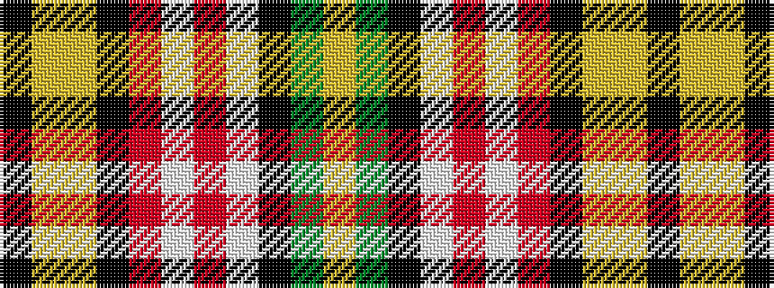

KYYKRWRWKGY

It is a 11 stripe tartan.

<figure class="pat-woven">

<figcaption>idealised sample</figcaption>
</figure>

## Colour Sequence



## Tartans with this colour sequence

| Tartans |
|---------------|
| [MacLellan Dress (Personal)](/setts/s11/k4ly2lg13k8r2w13r2w13k2g12ly4~x2/)|
||
