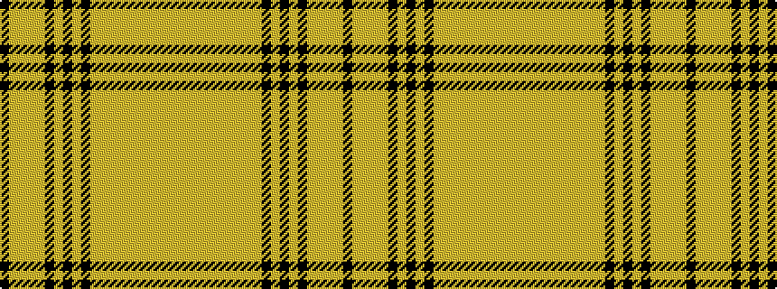

KYYYYKYKYKYYYYYYYYYY

It is a 20 stripe tartan.

<figure class="pat-woven">

<figcaption>idealised sample</figcaption>
</figure>

## Colour Sequence



## Tartans with this colour sequence

| Tartans |
|---------------|
| [Highland Aircraft](/setts/s20/k2loi4lo5loii2lo1k1lo2k12lo2k1lo2loii6loi7loii3loi12loii1lo4loii1lo12loi1~x2/)|
||
