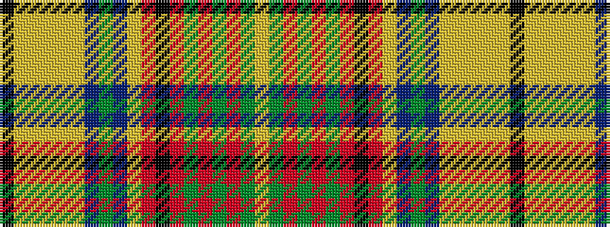

KYYYYYBGBYRKRGRGRGY

It is a 19 stripe tartan.

<figure class="pat-woven">

<figcaption>idealised sample</figcaption>
</figure>

## Colour Sequence



## Tartans with this colour sequence

| Tartans |
|---------------|
| [Harmon Dress (Personal)](/setts/s19/k2lr6ly2lr2ly2lr19db2g2db2lr2r4k2r11g2r2g2r11g2ly2~x2/)|
||
