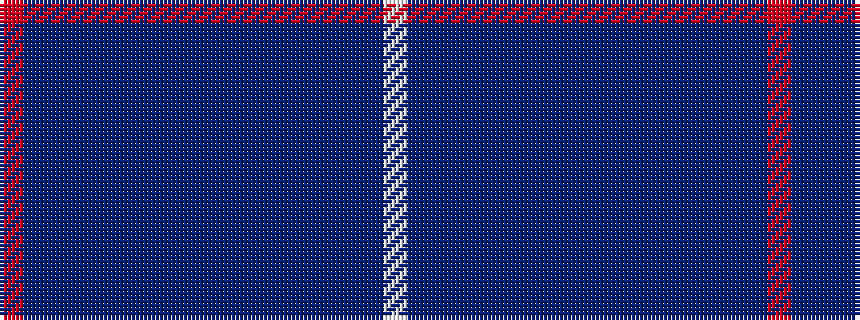

RBBBBBBBBBBBBBBBW

It is a 17 stripe tartan.

<figure class="pat-woven">

<figcaption>idealised sample</figcaption>
</figure>

## Colour Sequence



## Tartans with this colour sequence

| Tartans |
|---------------|
| [Pride of Lorient (Fashion)](/setts/s17/r2t8db1t4db2t3db3t1db15dt1db4dt2db2dt4db1dt9lb2~x2/)|
||
