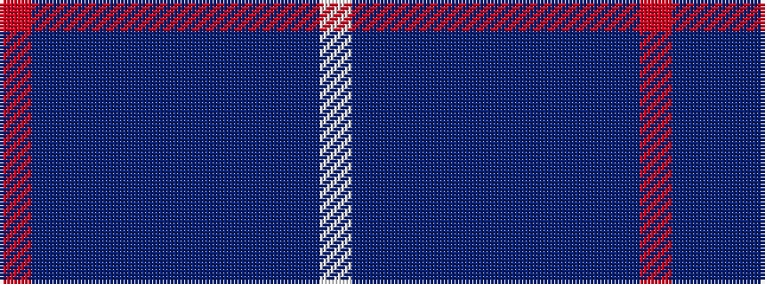

RBBBBBBBBBW

It is a 11 stripe tartan.

<figure class="pat-woven">

<figcaption>idealised sample</figcaption>
</figure>

## Colour Sequence



## Tartans with this colour sequence

| Tartans |
|---------------|
| [Toronto Blue Jays](/variants/s11/r2dp1t13n13dp4n4dp4n4t13dp1w2~x2/)|
||
