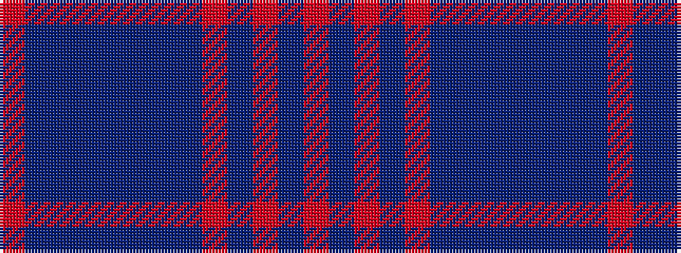

RBBBBBBBRBRBR

It is a 13 stripe tartan.

<figure class="pat-woven">

<figcaption>idealised sample</figcaption>
</figure>

## Colour Sequence



## Tartans with this colour sequence

| Tartans |
|---------------|
| [Vincent](/variants/s13/r1b4do4b1do4db4do1db4r4db1r4b4r1~x6/)|
||
