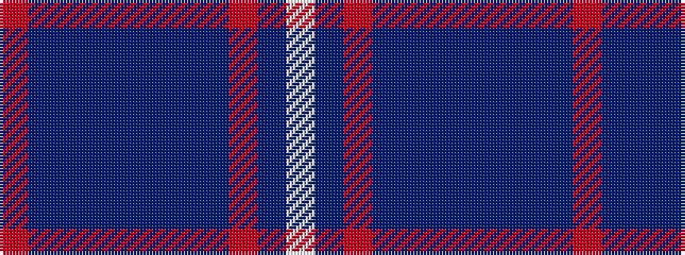

RBBBBBBBRBW

It is a 11 stripe tartan.

<figure class="pat-woven">

<figcaption>idealised sample</figcaption>
</figure>

## Colour Sequence



## Tartans with this colour sequence

| Tartans |
|---------------|
| [Royal Air Force](/setts/s11/r3b2t7b3t20db4dt8b20r3b7w2~x2/)|
||
