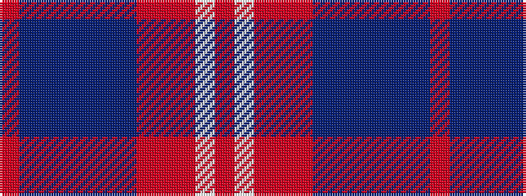

RBBBBBBRRRWR

It is a 12 stripe tartan.

<figure class="pat-woven">

<figcaption>idealised sample</figcaption>
</figure>

## Colour Sequence



## Tartans with this colour sequence

| Tartans |
|---------------|
| [Scotch, House Cailean](/setts/s12/o4w2o2r3o19b6db3b2db2b2db15o3~x2/)|
||
