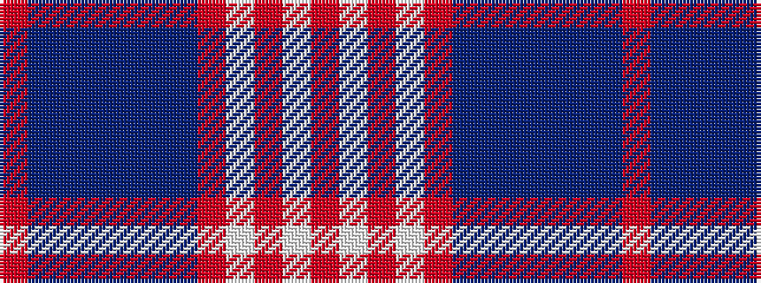

RBBBBBBRWRWR

It is a 12 stripe tartan.

<figure class="pat-woven">

<figcaption>idealised sample</figcaption>
</figure>

## Colour Sequence



## Tartans with this colour sequence

| Tartans |
|---------------|
| [Callum, Scotch House](/setts/s12/o4w2o2w3o20db6t3db2t2db2t16r3~x2/)|
||
