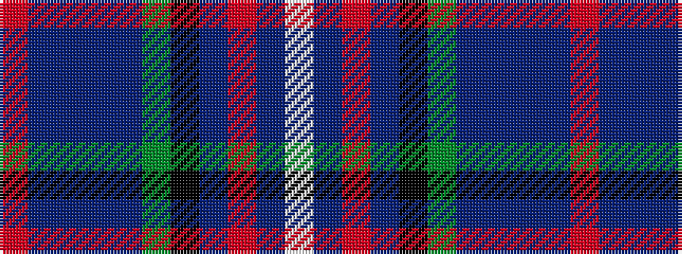

RBBBBGKBRBW

It is a 11 stripe tartan.

<figure class="pat-woven">

<figcaption>idealised sample</figcaption>
</figure>

## Colour Sequence



## Tartans with this colour sequence

| Tartans |
|---------------|
| [Air Force](/variants/s11/w4db8m3db25k13g4t29db3t8db2m3~x2/)|
||
