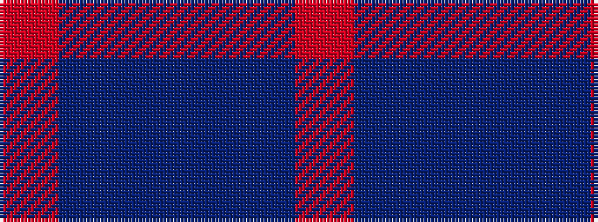

RBBBBR

It is a 6 stripe tartan.

<figure class="pat-woven">

<figcaption>idealised sample</figcaption>
</figure>

## Colour Sequence



## Tartans with this colour sequence

| Tartans |
|---------------|
| [Bristol Gramar School Check (School)](/setts/s6/r4n3n12db8n2r4/)|
||
| [St. Edmunds (School)](/setts/s6/r4b3t11db8b2r4/)|
||
