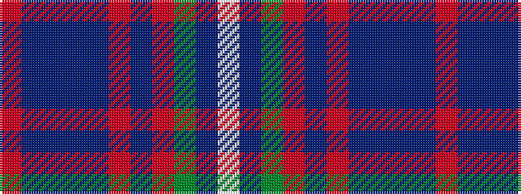

RBBBBRBRGBW

It is a 11 stripe tartan.

<figure class="pat-woven">

<figcaption>idealised sample</figcaption>
</figure>

## Colour Sequence



## Tartans with this colour sequence

| Tartans |
|---------------|
| [Coldstream](/setts/s11/w6db1g35r6b8r6dt8db5dt4db48r2~x2/)|
||
| [Queen of the South Football Club](/setts/s11/w3db1g18r3t4r3db4db3db2db24r1~x2/)|
||
