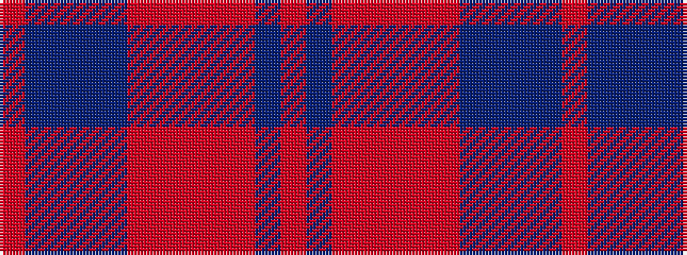

RBBBBRRRRRBR

It is a 12 stripe tartan.

<figure class="pat-woven">

<figcaption>idealised sample</figcaption>
</figure>

## Colour Sequence



## Tartans with this colour sequence

| Tartans |
|---------------|
| [Beanpole Brown Trial](/setts/s12/o4do31o2r2o2r2o2do2doi2do4doi11o4/)|
||
