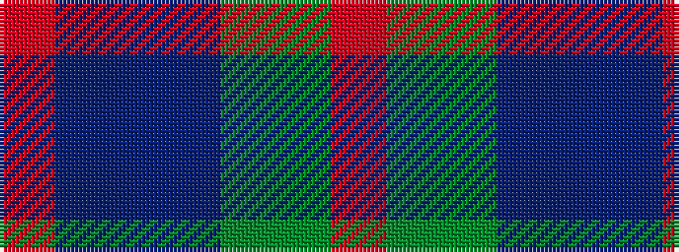

RBBBGGR

It is a 7 stripe tartan.

<figure class="pat-woven">

<figcaption>idealised sample</figcaption>
</figure>

## Colour Sequence



## Tartans with this colour sequence

| Tartans |
|---------------|
| [Uitwaaien Papi (Personal)](/variants/s7/r5do8dp13dt21dg34dgi55r3/)|
||
