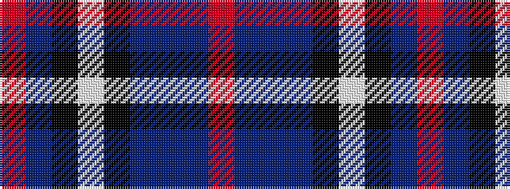

RBBBKWKBR

It is a 9 stripe tartan.

<figure class="pat-woven">

<figcaption>idealised sample</figcaption>
</figure>

## Colour Sequence



## Tartans with this colour sequence

| Tartans |
|---------------|
| [Wcwm 1475-2](/variants/s9/r2db34k2lb2k2n30db3n6r2~x2/)|
||
