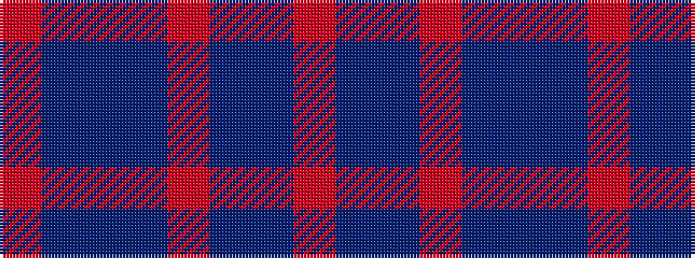

RBBBRBBR

It is a 8 stripe tartan.

<figure class="pat-woven">

<figcaption>idealised sample</figcaption>
</figure>

## Colour Sequence



## Tartans with this colour sequence

| Tartans |
|---------------|
| [Daks, Blue Loden](/setts/s8/o5t13dr4r4dr27t3dr4o5/)|
||
| [Daks, Muted blue](/setts/s8/o5db12db4o4db22db3db4o5/)|
||
