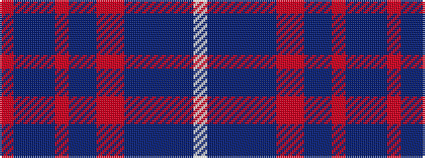

RBBBRBBRRBBBBBW

It is a 15 stripe tartan.

<figure class="pat-woven">

<figcaption>idealised sample</figcaption>
</figure>

## Colour Sequence



## Tartans with this colour sequence

| Tartans |
|---------------|
| [Northfield Academy](/setts/s15/o2dt1b2dt2r1b12dt2r1r10dt28b1dt3b2dt3w1~x2/)|
||
