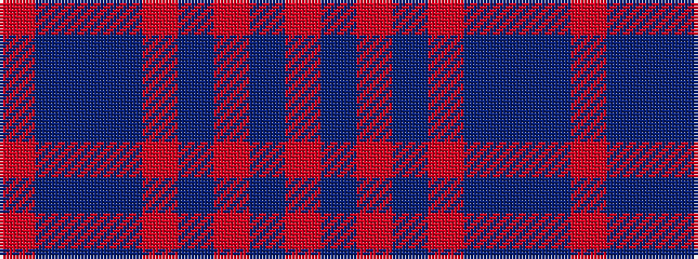

RBBBRBRBR

It is a 9 stripe tartan.

<figure class="pat-woven">

<figcaption>idealised sample</figcaption>
</figure>

## Colour Sequence



## Tartans with this colour sequence

| Tartans |
|---------------|
| [Edwards](/variants/s9/o37db4o7db4o9db40t2db4o2/)|
||
