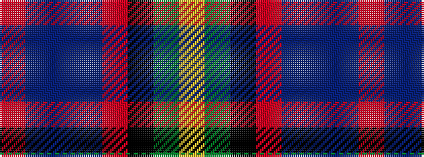

RBBBRKGY

It is a 8 stripe tartan.

<figure class="pat-woven">

<figcaption>idealised sample</figcaption>
</figure>

## Colour Sequence



## Tartans with this colour sequence

| Tartans |
|---------------|
| [Caledonian Labrador Retrievers](/setts/s8/m21db4dr5db4m5k21g21ly5~x2/)|
||
