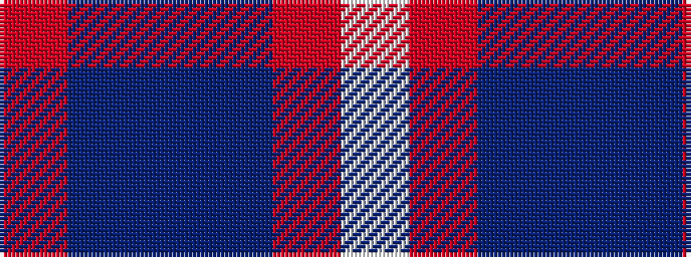

RBBBRW

It is a 6 stripe tartan.

<figure class="pat-woven">

<figcaption>idealised sample</figcaption>
</figure>

## Colour Sequence



## Tartans with this colour sequence

| Tartans |
|---------------|
| [Fox-Eves Wedding (Personal)](/setts/s6/r9b6dt13b21o18w4~x2/)|
||
