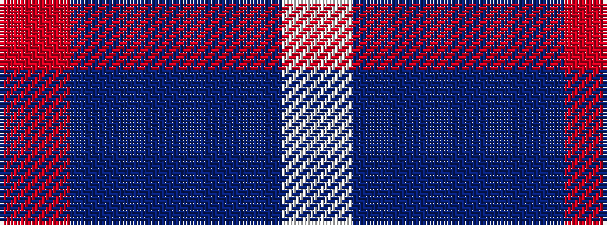

RBBBW

It is a 5 stripe tartan.

<figure class="pat-woven">

<figcaption>idealised sample</figcaption>
</figure>

## Colour Sequence



## Tartans with this colour sequence

| Tartans |
|---------------|
| [SABA](/setts/s5/w3dt2db15t15r2~x4/)|
||
| [World Fed. of Bldg Contractors (Corp](/setts/s5/r2db19n6b44lb2~x2/)|
||
| [World Federation of Building Contractors](/setts/s5/w4b44db19db44r2~x2/)|
||
