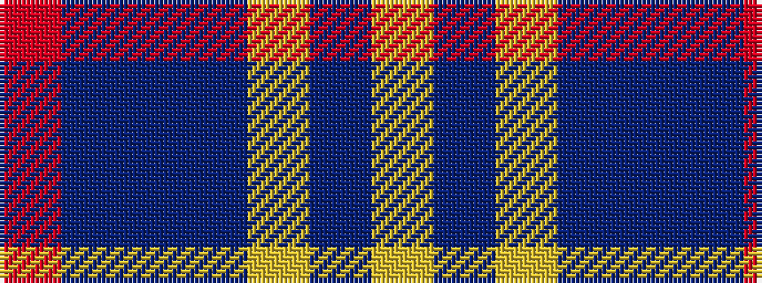

RBBBYBY

It is a 7 stripe tartan.

<figure class="pat-woven">

<figcaption>idealised sample</figcaption>
</figure>

## Colour Sequence



## Tartans with this colour sequence

| Tartans |
|---------------|
| [13, Legion Branch 50](/setts/s7/r68db9t10db13ly1db1ly2~x2/)|
||
