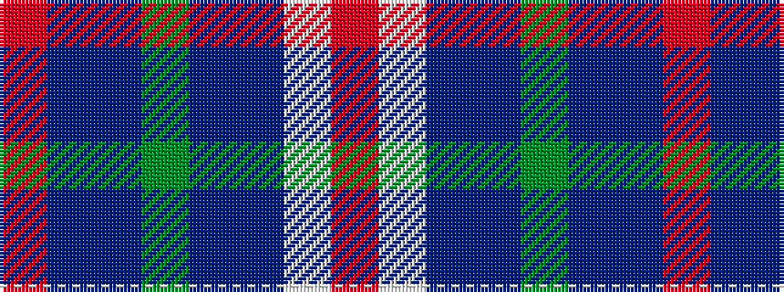

RBBGBBWR

It is a 8 stripe tartan.

<figure class="pat-woven">

<figcaption>idealised sample</figcaption>
</figure>

## Colour Sequence



## Tartans with this colour sequence

| Tartans |
|---------------|
| [Mullikin (2013)](/setts/s8/r5w4db6db2g43db2db4r3~x2/)|
||
