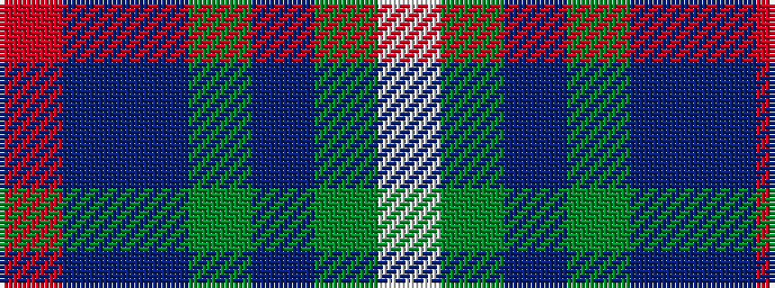

RBBGBGW

It is a 7 stripe tartan.

<figure class="pat-woven">

<figcaption>idealised sample</figcaption>
</figure>

## Colour Sequence



## Tartans with this colour sequence

| Tartans |
|---------------|
| [MX-5 Owners' Club](/variants/s7/r6db27t2g2t2g30w4~x2/)|
||
