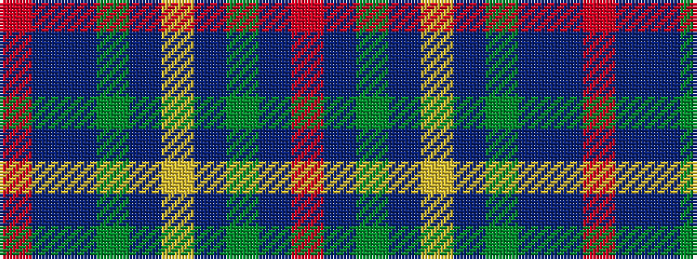

RBBGBYBGBR

It is a 10 stripe tartan.

<figure class="pat-woven">

<figcaption>idealised sample</figcaption>
</figure>

## Colour Sequence



## Tartans with this colour sequence

| Tartans |
|---------------|
| [Royal Dornoch Golf Club, The](/setts/s10/r12db22dg5db3ly3db3dg17b9dr7r2~x2/)|
||
