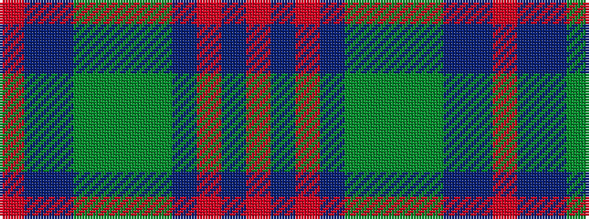

RBBGGGGBRBR

It is a 11 stripe tartan.

<figure class="pat-woven">

<figcaption>idealised sample</figcaption>
</figure>

## Colour Sequence



## Tartans with this colour sequence

| Tartans |
|---------------|
| [Glenisla (Fashion)](/setts/s11/o3dp5r2dp9y8dg2y4dg2n8db28o2~x2/)|
||
