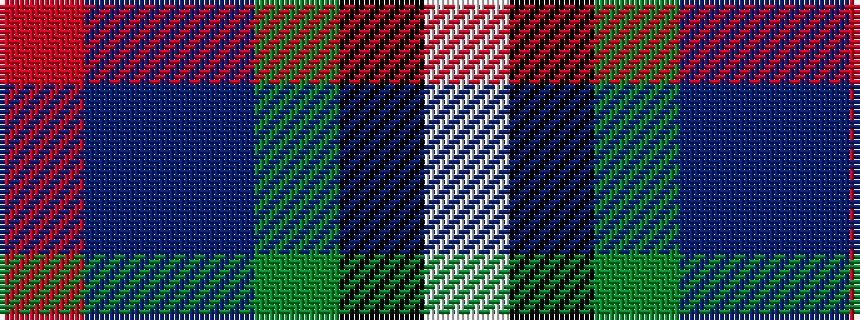

RBBGKW

It is a 6 stripe tartan.

<figure class="pat-woven">

<figcaption>idealised sample</figcaption>
</figure>

## Colour Sequence



## Tartans with this colour sequence

| Tartans |
|---------------|
| [Nicolson of Harris (Clan?)](/variants/s6/r3dbi15db8g5k2w1~x2/)|
||
