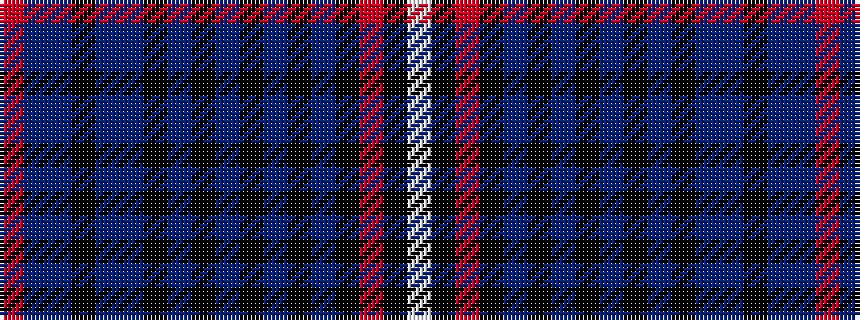

RBBKBBKBKBKBKBKRKW

It is a 18 stripe tartan.

<figure class="pat-woven">

<figcaption>idealised sample</figcaption>
</figure>

## Colour Sequence



## Tartans with this colour sequence

| Tartans |
|---------------|
| [Breeding](/setts/s18/w6k2r40k16dt6k2dt4k2n4k2t2k2n4dt7k2n6dt1r4~x2/)|
||
