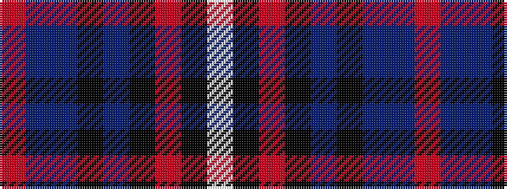

RBBKBKRKW

It is a 9 stripe tartan.

<figure class="pat-woven">

<figcaption>idealised sample</figcaption>
</figure>

## Colour Sequence



## Tartans with this colour sequence

| Tartans |
|---------------|
| [Galway County Crest (Fashion)](/variants/s9/o10t5db15k3db15k5r25k3w4~x2/)|
||
