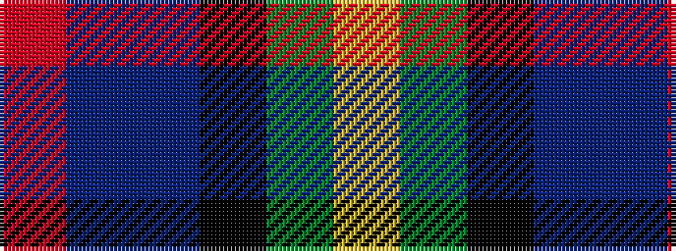

RBBKGY

It is a 6 stripe tartan.

<figure class="pat-woven">

<figcaption>idealised sample</figcaption>
</figure>

## Colour Sequence



## Tartans with this colour sequence

| Tartans |
|---------------|
| [Huntly Gordon](/setts/s6/r2dt3n12k11dg11ly2~x2/)|
||
| [Huntly Gordon 2000 (Commem)](/setts/s6/r2dt3b12k11g11ly2~x2/)|
||
