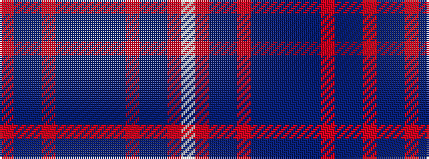

RBBRBBBBBRBBRW

It is a 14 stripe tartan.

<figure class="pat-woven">

<figcaption>idealised sample</figcaption>
</figure>

## Colour Sequence



## Tartans with this colour sequence

| Tartans |
|---------------|
| [Greer](/variants/s14/r12db10t3o3t3db3t16db3t3o3t3db10r12w4~x2/)|
||
