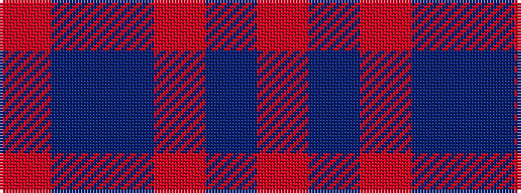

RBBRBR

It is a 6 stripe tartan.

<figure class="pat-woven">

<figcaption>idealised sample</figcaption>
</figure>

## Colour Sequence



## Tartans with this colour sequence

| Tartans |
|---------------|
| [Dege, of Saville Row](/setts/s6/o11db1o3db1db9r1~x4/)|
||
