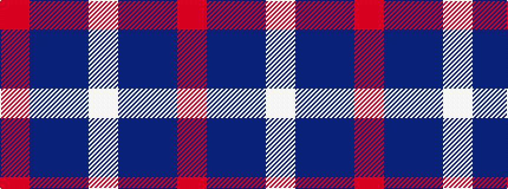

RBBW

It is a 4 stripe tartan.

<figure class="pat-woven">

<figcaption>idealised sample</figcaption>
</figure>

## Colour Sequence



## Tartans with this colour sequence

| Tartans |
|---------------|
| [Fong (Personal)](/variants/s4/r21db43dt86lb10/)|
||
| [Fong Wedding (Personal)](/variants/s4/r21dbi43db86w10/)|
||
