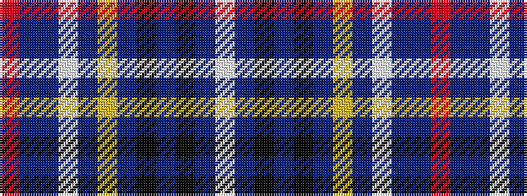

RBBWBYBKBKBW

It is a 12 stripe tartan.

<figure class="pat-woven">

<figcaption>idealised sample</figcaption>
</figure>

## Colour Sequence



## Tartans with this colour sequence

| Tartans |
|---------------|
| [Murison (2014)](/variants/s12/r4db11t4w3t4lo6db3k3db4k1db30w3~x2/)|
||
