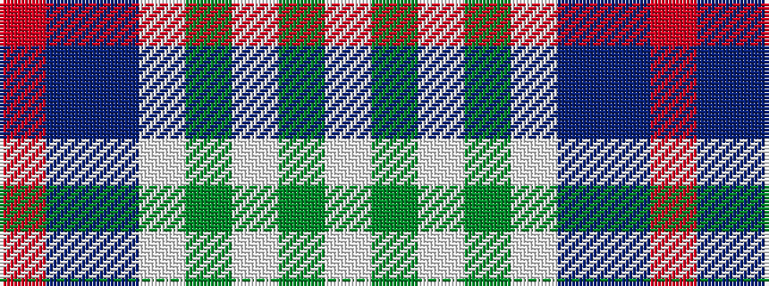

RBBWGWGW

It is a 8 stripe tartan.

<figure class="pat-woven">

<figcaption>idealised sample</figcaption>
</figure>

## Colour Sequence



## Tartans with this colour sequence

| Tartans |
|---------------|
| [Culloden Dress Ancient](/setts/s8/r6db2dp21w3dg19w26dg3w5~x2/)|
||
| [Culloden, dress Ancient](/setts/s8/r6db2p21w3dg19w26dg3w5~x2/)|
||
