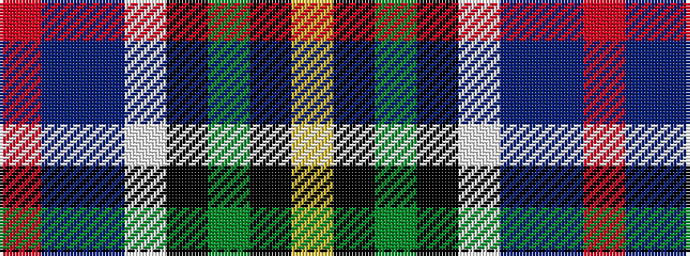

RBBWKGKY

It is a 8 stripe tartan.

<figure class="pat-woven">

<figcaption>idealised sample</figcaption>
</figure>

## Colour Sequence



## Tartans with this colour sequence

| Tartans |
|---------------|
| [Culloden, Gold](/variants/s8/r5t2dp14w2k13y13k2ly3~x2/)|
||
