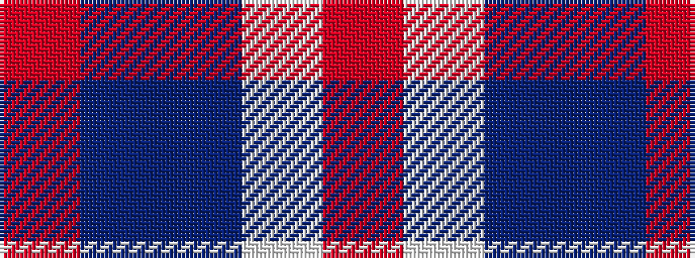

RBBWR

It is a 5 stripe tartan.

<figure class="pat-woven">

<figcaption>idealised sample</figcaption>
</figure>

## Colour Sequence



## Tartans with this colour sequence

| Tartans |
|---------------|
| [Lands of Liberty](/setts/s5/r10w5db30b20r3~x4/)|
||
| [Lands of Liberty (Fashion)](/setts/s5/r15w10db48t32r6~x2/)|
||
| [Wedding](/setts/s5/o2dr1dp30w1o2~x2/)|
||
