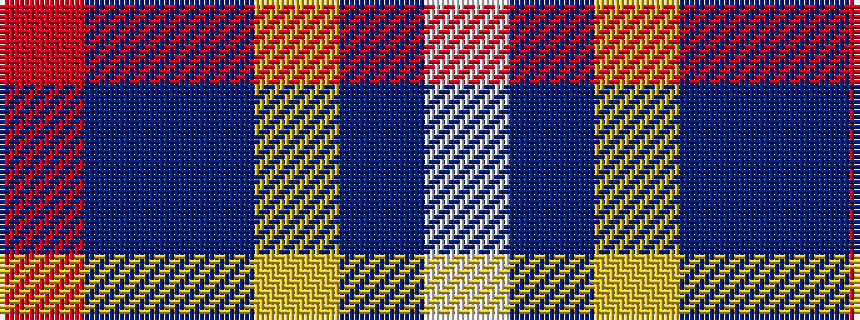

RBBYBW

It is a 6 stripe tartan.

<figure class="pat-woven">

<figcaption>idealised sample</figcaption>
</figure>

## Colour Sequence



## Tartans with this colour sequence

| Tartans |
|---------------|
| [Afternoon Tea / Earl Grey](/variants/s6/r15t98dt72ly25dt8w15/)|
||
| [Afternoon Tea / Earl Grey](/variants/s6/r15t98db72ly25db8w15/)|
||
