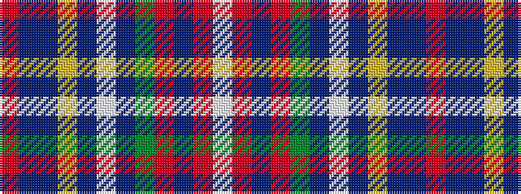

RBBYBWBGRBRW

It is a 12 stripe tartan.

<figure class="pat-woven">

<figcaption>idealised sample</figcaption>
</figure>

## Colour Sequence



## Tartans with this colour sequence

| Tartans |
|---------------|
| [Wilson's No 4](/variants/s12/r64t16p18ly4p4w4p18g32r14t4r14w3~x2/)|
||
