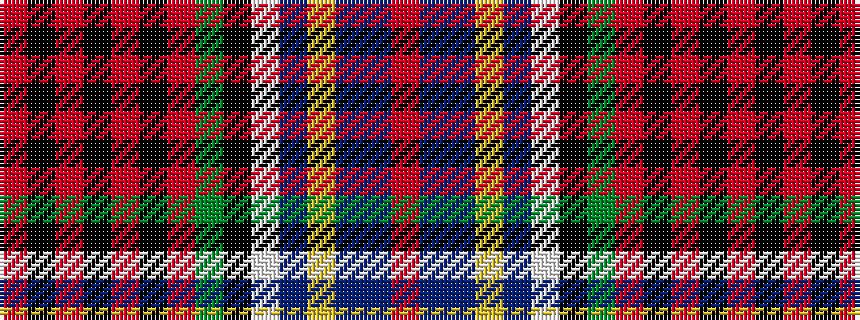

RBBYBWKGRKRKRKR

It is a 15 stripe tartan.

<figure class="pat-woven">

<figcaption>idealised sample</figcaption>
</figure>

## Colour Sequence



## Tartans with this colour sequence

| Tartans |
|---------------|
| [MacRae of Ardentoul](/setts/s15/r80k1r2k3r2k1r3dg18k1w1db2ly1db18t3r12~x2/)|
||
