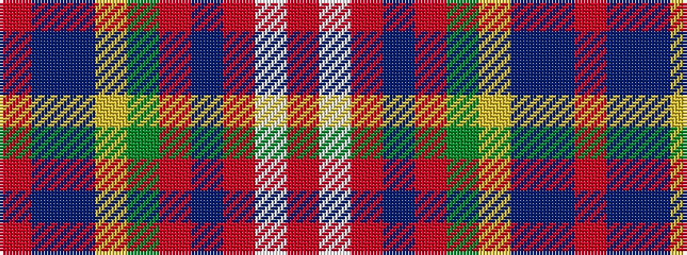

RBBYGRBRWR

It is a 10 stripe tartan.

<figure class="pat-woven">

<figcaption>idealised sample</figcaption>
</figure>

## Colour Sequence



## Tartans with this colour sequence

| Tartans |
|---------------|
| [Unidentified No 57](/setts/s10/r6w1r6db2r6dg12ly1db8t4r4~x2/)|
||
| [Unnamed No 57](/setts/s10/r6w1r6db2r6g12ly1db8t4r4~x2/)|
||
