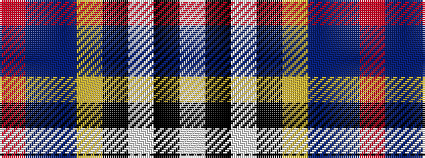

RBBYKWKW

It is a 8 stripe tartan.

<figure class="pat-woven">

<figcaption>idealised sample</figcaption>
</figure>

## Colour Sequence



## Tartans with this colour sequence

| Tartans |
|---------------|
| [Culloden Dress](/variants/s8/r6t3dp24ly2k23w23k2w6~x2/)|
||
| [Culloden, Dress](/variants/s8/r6t3p24ly2k23w23k2w6~x2/)|
||
