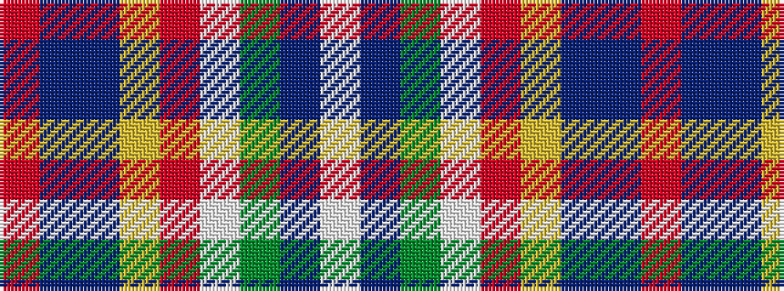

RBBYRWGBW

It is a 9 stripe tartan.

<figure class="pat-woven">

<figcaption>idealised sample</figcaption>
</figure>

## Colour Sequence



## Tartans with this colour sequence

| Tartans |
|---------------|
| [Wilson's, No 227](/variants/s9/r26t7p8ly3r3w3g20p10w2~x2/)|
||
