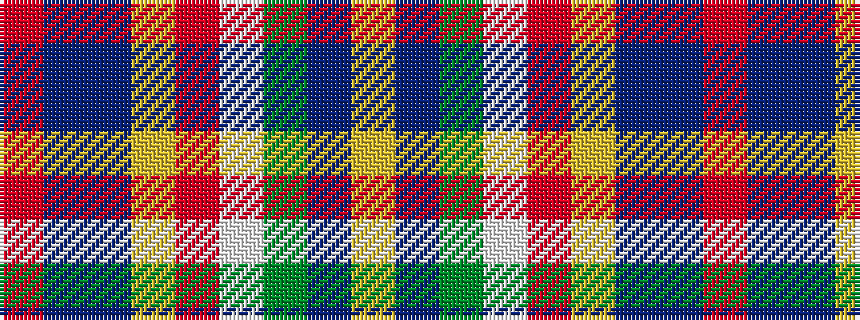

RBBYRWGBY

It is a 9 stripe tartan.

<figure class="pat-woven">

<figcaption>idealised sample</figcaption>
</figure>

## Colour Sequence



## Tartans with this colour sequence

| Tartans |
|---------------|
| [Unidentified No 14](/variants/s9/r22t6db10ly4r4w4dg22db8ly3/)|
||
| [Unnamed No 14](/variants/s9/r22t6db10ly4r4w4g22db8ly3/)|
||
