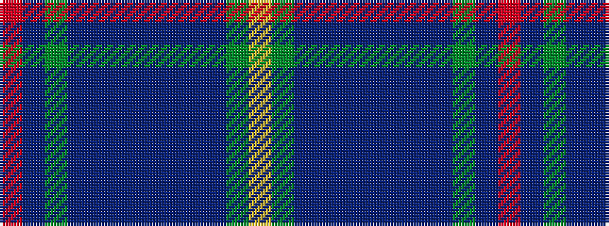

RBGBBBBBBBGY

It is a 12 stripe tartan.

<figure class="pat-woven">

<figcaption>idealised sample</figcaption>
</figure>

## Colour Sequence



## Tartans with this colour sequence

| Tartans |
|---------------|
| [Los Angeles Police Bagpipe Band](/setts/s12/r2dt6g15db6dt4db4dt28db4dt4db6g6ly2~x2/)|
||
