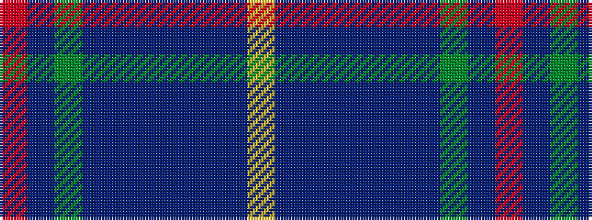

RBGBBBBBBY

It is a 10 stripe tartan.

<figure class="pat-woven">

<figcaption>idealised sample</figcaption>
</figure>

## Colour Sequence



## Tartans with this colour sequence

| Tartans |
|---------------|
| [Blue Peter](/setts/s10/lo3db25dbi4db4dbi4db4dbi25g4dp4o2~x2/)|
||
