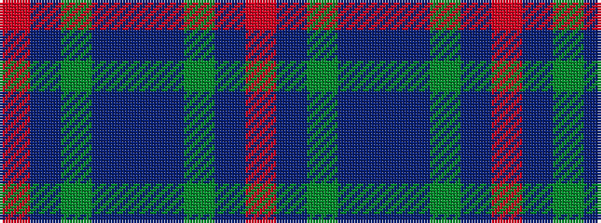

RBGBBBGBR

It is a 9 stripe tartan.

<figure class="pat-woven">

<figcaption>idealised sample</figcaption>
</figure>

## Colour Sequence



## Tartans with this colour sequence

| Tartans |
|---------------|
| [Amazing Union (Personal)](/setts/s9/r2do15dg12do2dt12do2dg12do15o2~x4/)|
||
